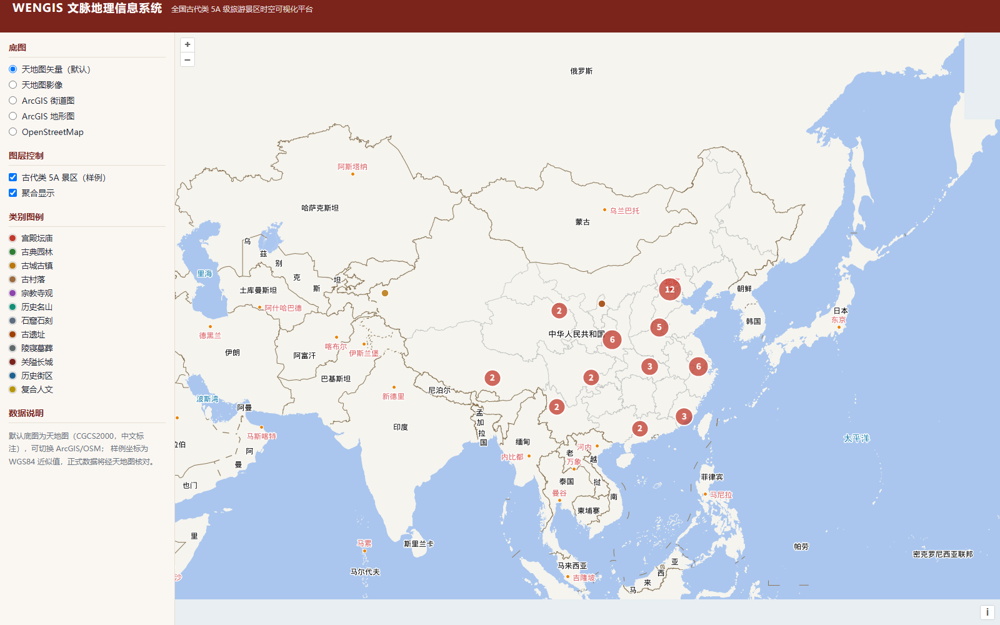
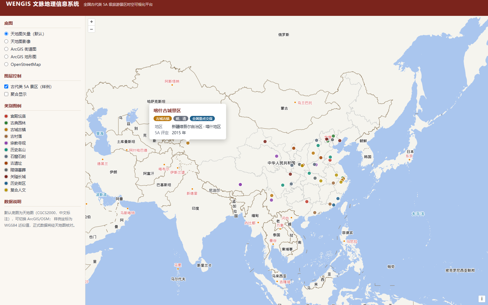
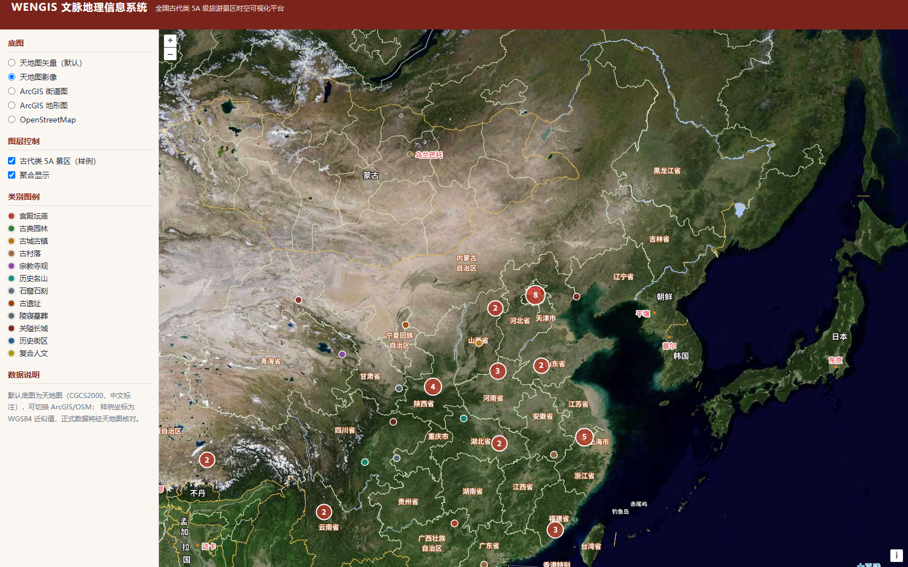

# WENGIS 文脉地理信息系统

**Wen Culture Geographic Information System**
——基于开源 GIS 技术栈的全国古代类 5A 级旅游景区时空可视化平台（WebGIS 课程作业）

## 一、项目定位

以全国 5A 级旅游景区中**古代文化类景区**为研究对象，用开源 WebGIS 技术呈现中华文脉的空间格局：
宫殿坛庙、古典园林、古城古镇、石窟石刻、宗教寺观、陵寝关隘、历史名山在全国的分布与朝代脉络。

- 数据基准：文旅部全国 5A 景区 **358 家**官方名单（2025 口径），按文化标准筛选古代类（预计 150–180 家）。
- 双时间维度：`ratingYear`（5A 评定年份，现代管理）+ `dynasty`（始建/主体朝代，古代文化主轴）。
- 纯 FOSS 架构：OpenLayers + GeoServer + PostGIS + OSM，无商业 GIS 组件。

## 二、技术栈

| 层 | 技术 | 版本 | 用途 |
|---|---|---|---|
| 前端渲染 | OpenLayers | ^10.10 | 地图、聚合、弹窗、图层控制 |
| 统计图表 | ECharts | ^6.1 | 类别/省份/朝代统计（下一阶段接入） |
| 构建 | Vite + TypeScript（strict） | ^8.3 / ^7.0 | 工程化，类型零 any |
| 空间数据库 | PostgreSQL 18 + PostGIS 3.6+ | 已装 PG / 待装 PostGIS | 空间存储与查询 |
| 地图服务 | GeoServer 2.28.x + JDK 21 | 待安装 | WMS/WFS 发布 |
| 底图 | 天地图（默认）/ ArcGIS Online / OSM | — | 天地图 CGCS2000 中文标注；ArcGIS/OSM 为无 key 备选；均与 WGS84 数据无偏移 |

## 三、目录结构

```
webgis/
├── data/
│   ├── raw/mct_5a_2025.txt            # 官方 358 家名单存档
│   └── geojson/ancient_5a.sample.geojson  # 样例工作数据（47 点）
├── docs/
│   ├── 01_数据口径与分类.md            # 筛选标准、12 类定义、字段与坐标规范
│   ├── 02_PostGIS部署.md              # 安装、建库、入库、验证
│   └── 03_GeoServer发布.md            # 安装、SLD、WMS/WFS 发布与前端接入
├── sql/
│   ├── 01_create_db.sql               # 建库
│   ├── 02_create_schema.sql           # PostGIS 扩展、空间表、索引、视图
│   └── 03_verify.sql                  # 验证与空间查询
├── scripts/
│   ├── dev.sh / dev.ps1               # 启动开发服务器（端口 43200）
│   ├── build.sh / build.ps1           # 数据校验 + 构建
│   ├── validate-data.mjs              # GeoJSON 校验
│   └── geojson2sql.mjs                # GeoJSON -> INSERT（GDAL 兜底）
├── src/
│   ├── config/layers.ts               # 视图、类别配色、底图配置
│   ├── types/spot.ts                  # 数据强类型
│   ├── map/                           # MapViewer / 底图 / 点位图层 / 弹窗
│   ├── data/spotsRepository.ts        # 数据加载与运行时校验
│   └── main.ts                        # 入口
└── index.html
```

## 四、快速开始

```powershell
Set-Location D:\webgis
npm install
# 配置天地图 key（可选但推荐：中文标注、标准国界线；不配置则自动回退 ArcGIS 底图）
Copy-Item .env.example .env.local   # 编辑 .env.local 填入 VITE_TIANDITU_KEY
npm run validate-data               # 校验 GeoJSON
npm run dev                         # http://localhost:43200
```

天地图 key 免费申请：https://console.tianditu.gov.cn/ （`.env.local` 已被 .gitignore 忽略，不进入代码仓库）。

构建：`npm run build`（先 `tsc --noEmit` 类型检查，再 Vite 打包）。

## 五、运行效果（最小 demo 已验证）

- 天地图矢量底图 + 47 点聚合（按 12 类着色）：



- 散点模式 + 点击弹窗（类别/朝代/世遗/文保标签、地区、评定年份）：



- 天地图影像底图 + 中文注记：



端到端验证（puppeteer-core + 系统 Edge，8 项断言全过）：图例 12 项、单点弹窗、空白关闭、聚合放大、底图切换、无运行时错误。

## 六、当前进度

- [x] 官方 358 家名单获取与存档（文旅部数据服务页 + 政务门户，双源核对）
- [x] 古代类筛选口径与 12 分类体系（docs/01）
- [x] 前端工程骨架（Vite + TS 严格模式 + OpenLayers）
- [x] 底图切换（天地图矢量/影像、ArcGIS 街道/地形、OSM）+ 47 点聚合 + 类别配色 + 弹窗 + 图层开关
- [x] 端到端交互验证（弹窗/聚合放大/底图切换，8/8 断言通过）
- [x] GeoJSON 数据校验与 GeoJSON→SQL 工具
- [x] PostGIS 建库建表 SQL、GeoServer 发布文档
- [ ] 安装 PostGIS 3.6+（需 postgres 密码，见 docs/02）
- [ ] 安装 JDK 21 + GeoServer 2.28.x（见 docs/03）
- [ ] 358 家全量筛选与坐标地理编码（150–180 家）
- [ ] 朝代时间轴、类别/省份筛选、ECharts 统计图
- [ ] 省界面图层、核密度分析、WMS/WFS 接入

## 七、课程考核点对应

| 考核内容 | 项目落点 |
|---|---|
| WMS/WFS 标准服务 | GeoServer 发布 ancient_5a、provinces（docs/03） |
| 空间数据库 | PostGIS 建表、GIST 索引、空间查询视图（sql/02、03） |
| 矢量图层与渲染 | OpenLayers Cluster + 分类符号化 |
| 交互查询 | Overlay 弹窗、点击查询、图层开关 |
| 时空可视化 | 朝代时间轴（开发中）、5A 评定批次时序 |
| 开源合规 | 仅 FOSS 组件；底图与数据均标注来源 |
